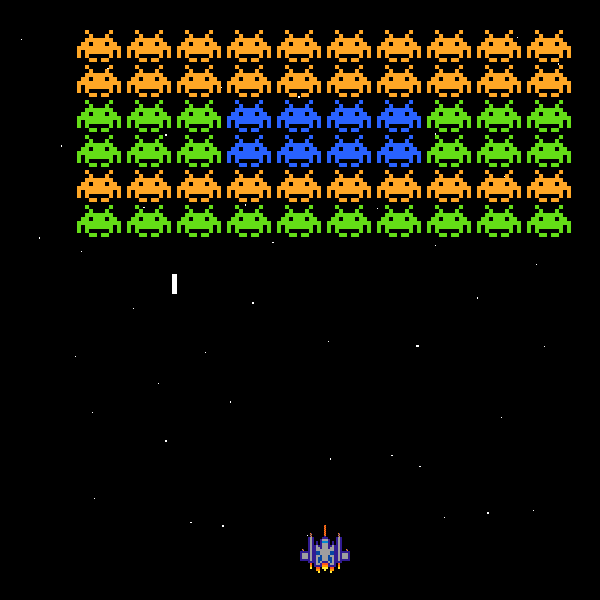
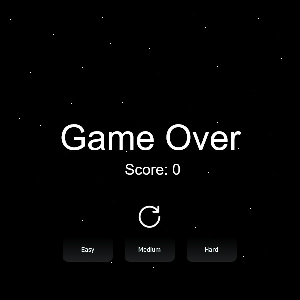

# Space Invaders - Game Dev

Simple Space Invaders game, where aliens  at the top of the screen; they move side to side and down towards our player. At random the enemies will shoot bullets. At the bottom of the screen we have our spaceship which can shoot at the enemies. Unlike the original game our bullets shoot much faster, which also makes the game much more fun. The objective is to stay alive, avoid the enemies bullets and eliminate the enemies before they reach the bottom of the screen.

You can choose difficult or restart game.

## We will cover the following topics and more:

- Game loop
- Keyboard input
- Moving our enemies
- Collision detection
- Shooting bullets
- Game audio
- Difficulty
- Score

Try:
https://milia20.github.io/space-invaders-js/
